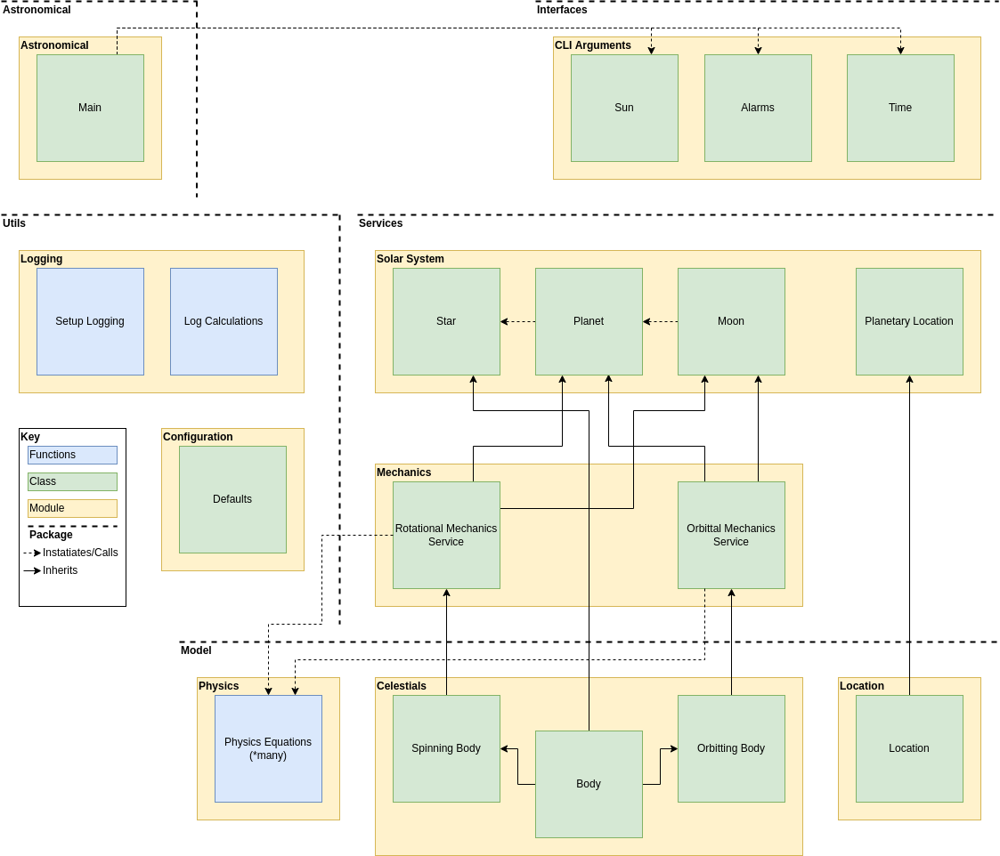

# Astronomical
> Library of utilities related to astronomical movements

This module provides information about the sun, moon, seasons and tides according to the user's current whereabouts.

## Get Started
To install run from inside the directory:
```bash
git clone git@gitlab.com:TheOrganist24/astronomical.git
cd astronomical
make
make install
astronomical --version
```

### Set a Default Location
You can set up an optional location, if you don't it'll default to London.

```
# ~/.astronomical

[location]
name = "London"
longitude = 0.1276
latitude = 51.5072

[sleep]
sleep = 28800
earliest_wake_up = 07:00:00
latest_wake_up = 06:00:00
ablutions = 3600
```

For more options look at [Test Config](tests/data/config.ini).


## Design Notes


### Logging Strategy
See [Logging](docs/logging.md).


## Development
### Setting up Environment
```bash
git clone git@gitlab.com:TheOrganist24/astronomical.git
cd astronomical
git checkout development
make dev
export LOG_LEVEL=INFO  # Optional; supports TRACE, DEBUG, INFO, WARNING, ERROR, CRITICAL
poetry run astronomical --version
```


### Workflow
1. Review [TODO](TODO.md) list
2. Work off `development` branch
3. Refresh environment `make fresh`
4. Design feature using [TODO](TODO.md) list and/or diagram (`DOCS:` commit)
5. Write tests* (`TEST:` commit)
6. Change or add code (`FUNC:` commit)
7. Update [TODO](TODO.md) list versioning and transfer completed items to [CHANGELOG](CHANGELOG.md)
8. [Version](#Versioning) bump
9. Merge to `main`
10. Tag `git tag -s $(cat VERSION)`


### Versioning
Semantic versioning is used:
```
poetry version <major/minor/patch>
poetry version --short > VERSION
```

Also don't forget to update the [package `__init__.py`](astronomical/__init__.py) and [package tests](tests/test_astronomical.py).


### Lint and Test
Code should be compliant with PEPs 8, 256, 484, and 526.
```bash
make check  # calls `make lint; make test`
```