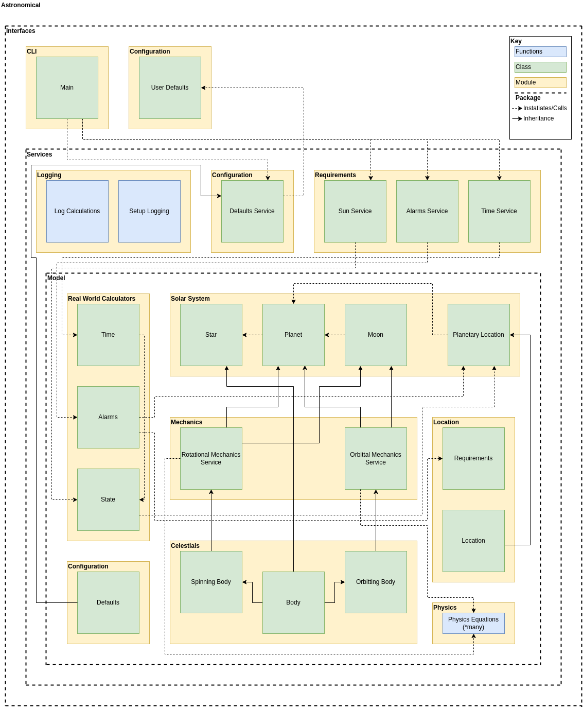

# Astronomical
> Library of utilities related to astronomical movements

This module provides information about the sun, moon, seasons and tides according to the user's current whereabouts and whenabouts.


## Get Started
Once installed run:
```bash
astronomical --help
```

### Set a Default Location
You can setup an optional location, if you don't it'll default to London.

```
# ~/.astronomical

[location]
name = "London"
longitude = 0.1276
latitude = 51.5072
```

## Design Notes


### Logging Strategy
Logging should be woven throughout the application. Log levels supported here are DEBUG, INFO, WARNING, ERROR, and CRITICAL.
* **DEBUG**:
  * Class instantiations - only done at the most base classes in the model layer to denote the usage of any class
  * Base function invokations - only done on core functions found in the model layer to denote the usage of it
  * Service class method returns - done in the service layer to highlight the outputs of serivce class methods
  * Command line tool argument - done in the package script to show which option is being used
* **INFO**:
  * Interface class instantiations - highlight the beginning of a happy path for a particular option
  * Interface class method returns - to confirm the end of the happy path for a given option
* **WARNING**:
* **ERROR**:
* **CRITICAL**:

**Nb.** Whenever the astronomical tool is used, objects are created for the earth and the sun, this triggers a DEBUG log on import.

## Development
### Setting up Environment
```bash
git clone git@gitlab.com:TheOrganist24/astronomical.git
cd astronomical
make dev-environment
export LOG_LEVEL=ERROR  # Optional; supports DEBUG, INFO, WARNING, ERROR, CRITICAL
poetry run python3 example.py
```

### Lint and Test
Code should be compliant with PEPs 8, 256, 484, and 526.
```bash
make lint
make test
```
