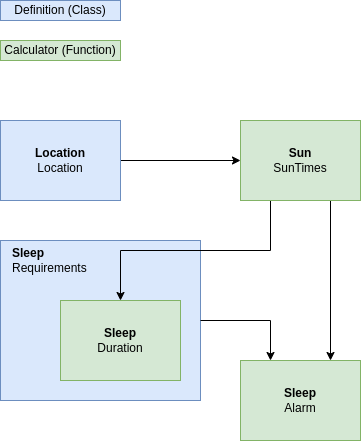

# Astronomical
> Library of utilities related to astronomical movements

This module provides information about the sun, moon, seasons and tides according to the user's current whereabouts and when-abouts.


## Get Started
```
git clone git@gitlab.com:TheOrganist24/astronomical.git
cd astronomical
cp pre-commit .git/hooks/
poetry install
poetry run python3 example.py
```


## Modules
### Physics
> Collection of Physics Equations for use in the rest of the package.

So far the module contains:
* **Constants**:
  * Universal Gravitational Constant
* **Conversions**:
  * Rotational Period -> Angular Velocity
* **Laws**:
  * Newton's Universal Law of Gravitation
  * Kepler's Laws of Orbits
  * Kepler's Law of Periods


### Globals
> Utilities related to the heavenly spheres.

This module returns the `CelstialBody` class, and the "Earth" object. Instantiated `CelestialBody` objects can have many of the expected attributes associated with them (eg. mass, sidereal period etc); however when it comes to orbittal relationships between bodies the following attributes are relevent:

```
sun = CelestialBody("Sun", 1.9885*10**30)      # Declare the Sun
earth = CelestialBody("Earth", 5.9722*10**24)  # Declare the earth

# Add the earth object to the sun object's `daughters` dictionary
# and set the earth object's `semimajor_axis` (to parent) attribute.
the_sun.add_daughters(earth, 149.60*10**9)
```

Calculations relating to orbittal mechanics then come from the the parent and often take the form `parent.orbittal_calculation(daughter.name)`.


### Location
> Utilities related to location.

This module returns the `Location` class for use throughout the rest of the package.
```
location = Location("Ivybridge", -3.9413, 50.3921)
```


### Sun
> Utilities related to the sun; including sunrise and sunset times.

This module currently returns sunrise and sunset times.
```
sunrise, sunset = sun.sun_times(location)
```


### Sleep
> Utilities related to sleep; including duration and alarms.

See [paper](https://www.ncbi.nlm.nih.gov/pmc/articles/PMC4720388/) which seems to suggest that natural sleep cycles are determined by temperature and sunrise times.  A rough summary for our purposes is that there is a sleep variation of ~1 hour between summer and winter (based around the soltices as maxima and minima) and that sleep length ranges from ~7-9 hours.  Additionally awakening time seems to be most directly correlated to sunrise and thus dictates the settling down to sleep time.

This component assumes a get up time closest to sunrise (within an optional varience), and an optionally defined sleep duration and varience.



This component provides the following:
```
sunrise, sunset = astronomical.sun.sun_times(location)
requirements = astronomical.sleep.Requirements()
sleep_duration = requirements.duration(night=today())
bedtime, morning_alarm = astronomical.sleep.alarms(requirements, location, night=today())
```


## Development
### Lint and Test
Code should be compliant with PEPs 8, 256, 484, and 526.
```
for LINTER in "pydocstyle" "pycodestyle" "mypy"
do 
  echo Running $LINTER
  $LINTER astronomical && echo -e " -> \e[32mpassed\e[0m" || echo -e " -> \e[31mfailed\e[0m"
done
```

To test:
```
poetry run python3 -m pytest tests/.
```
